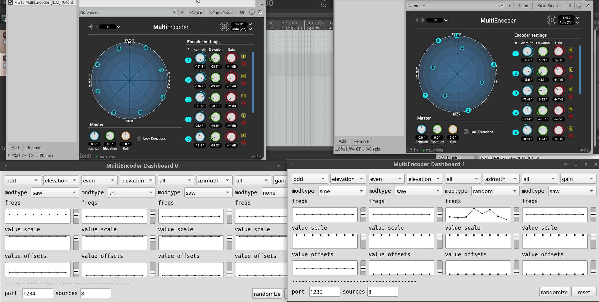

# MultiEncoderDashboard



## Work in progress...

### A dashboard for controlling and manipulating IEM's MultiEncoder plugin for ambisonics

A dashboard for controlling and manipulating IEM's MultiEncoder plugin for ambisonics using lfo's and OSC to create inticrate, complex patterns and trajectories of sound sources in 3D space.

### Installation

Open up SuperCollider and evaluate the following line of code:
`Quarks.install("https://github.com/madskjeldgaard/multiencoderdashboard")`

### Usage

```
m = MultiEncoderDashboard.new(numPanels: 4);
```

